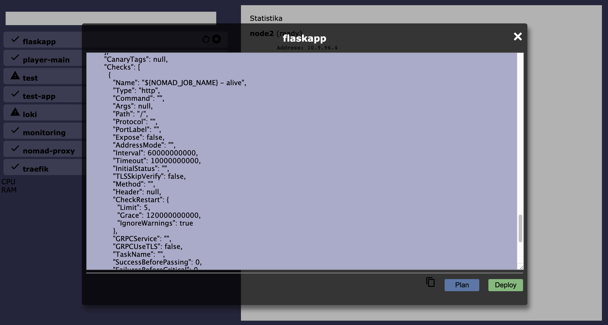

# Vue nomad dashboard


Very basic dashboard for the Nomad implemented in Vuejs. It is only silly proof of concept made to learn something new and to have fun...





## Run the appp


```bash

docker run -it --rm -p 8080:80 \
    -v $PWD/:/usr/share/nginx/html/ \
    -v $PWD/default.conf:/etc/nginx/conf.d/default.conf \
    --name nginx nginx

```

The application will be available at the address **http://localhost:8080/vue/index.html**.


This docker staff is required mainly because CORS...
